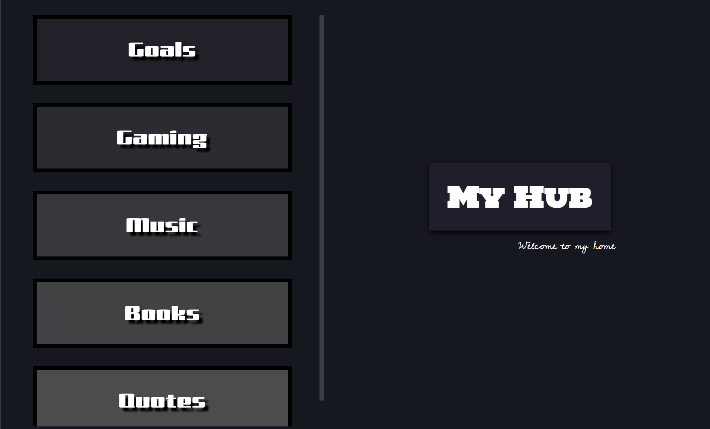

# My Personal Hub

## Overview
  Think of it as my personal workspace where I organize my goals, books, music, games I play, and even quotes I find encouraging. 

 ## Live Website: 
[Visit MyHub](https://adonaymendez.github.io/Personal-Hub/) 

## Features
  - Goals page that displays unique goals on click
  - Modal window pop-ups
  - Book library page
  - Gaming page
  - Music page

## Technologies Used 
  - HTML
  - CSS
  - JavaScript
  - Git / Git Hub

## Takeaways
It was truly a nice experience building this website, especially since it is my first complete website. What started off as one page (the Quotes page) became much more than I had expected. One page led to another as I got excited about trying different layouts and features. While the design aspect kept me engaged, I realized that functionality was something I needed to improve on. That led me to JavaScript, where I began learning how to make my website interactive rather than just visually appealing. Throught the project, I learned DOM manipluation, eventListeners, arrays, objects, functions, methods (forEach), plus Git and Github pages to host my website. The most important thing was code organization which is something that in this project I realzied is very important, especially as projects get more complex.  

  

## Future Improvements  
  - Responsive Design
  - Improved UI
  - Additional Sectons
